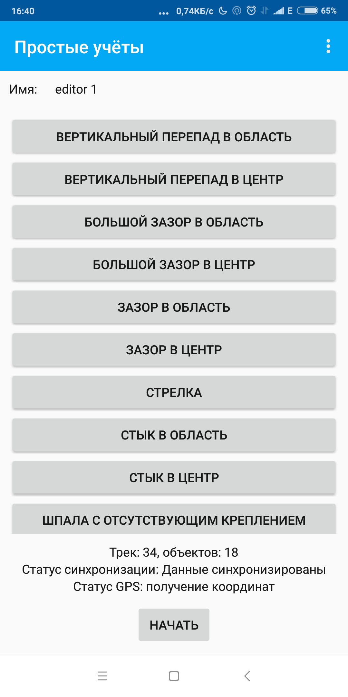
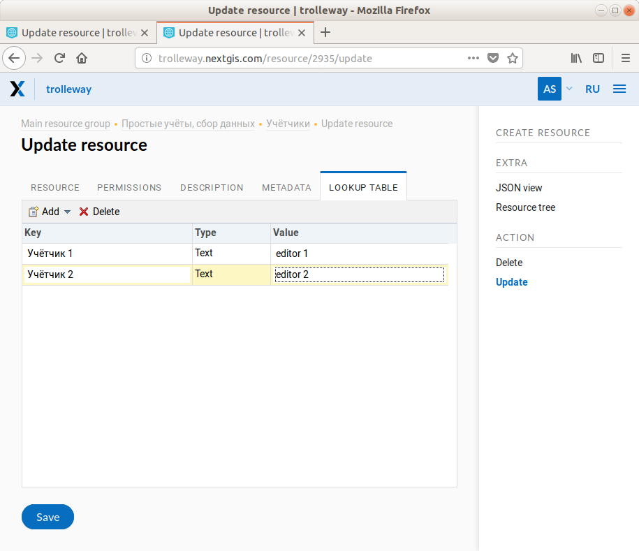
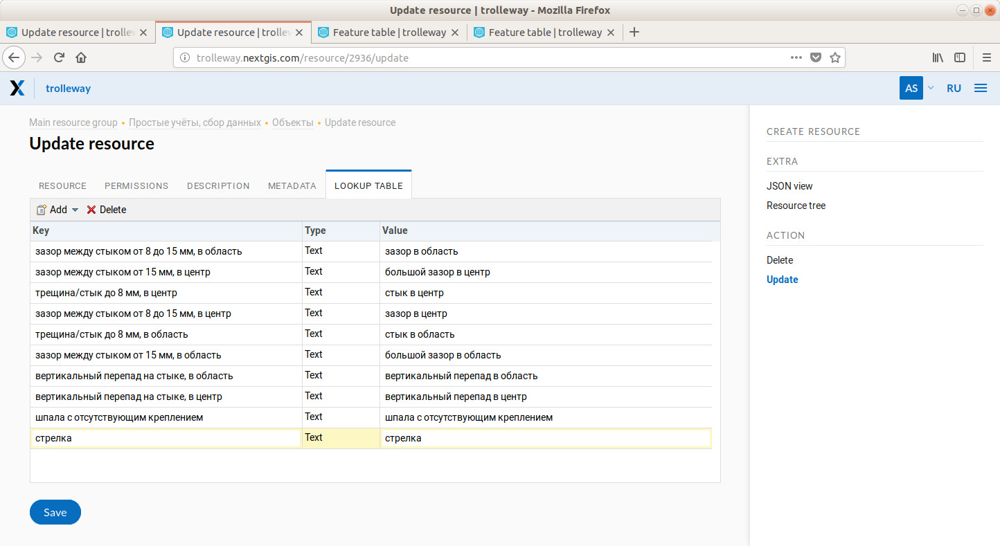
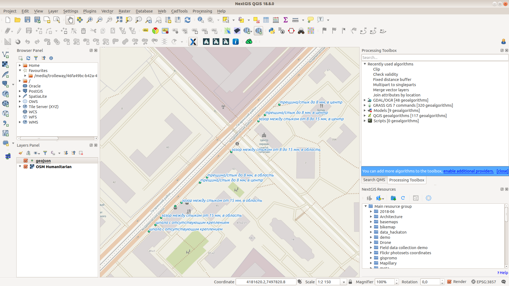
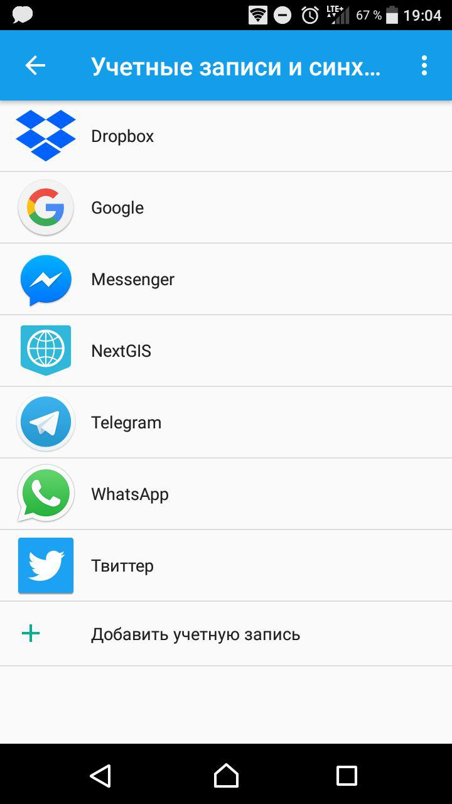

.. sectionauthor:: Artem Svetlov <artem.svetlov@nextgis.ru>

.. _ngsimplecollector_intro:

Введение
========

.. _ngsimplecollector_purpose:

**Простые учёты** это приложение для Android использующее Веб ГИС для сбора данных в поле. Простые учёты является альтернативой более сложным и универсальной связке Formbuilder + NextGIS Mobile. Приложение очень легко настраивать и максимально просто использовать для сбора данных.

  
   Общий вид окна программы

Как это работает
----------------
* Мобильное приложение свободно доступно на `Google Play <https://play.google.com/store/apps/details?id=com.nextgis.simple_collector>`_.
* Настройка проекта по сбору данных делается через Веб браузер в интерфейсе Веб ГИС.
* Сборщику нужно только установить приложение, ввести имя Веб ГИС, логин и пароль.
* Приложение автоматически синхронизирует данные с Веб ГИС. Данные не потеряются даже если пропадет интернет или отключится телефон/планшет.  Как только связь появится, синхронизация продолжится.
* Форма данных намерено максимально упрощен: точки с координатами, имя сборщика, тип объекта и несколько дополнительных полей. Данные легко загрузить и обработать в ГИС.

Установка для администратора
============================

1. Получите доступ к приложению для своей Веб ГИС.
2. Скачайте Простые учёты из Google Play.
3. Запустите приложение, введите имя Веб ГИС, логин, пароль. Приложение само создаст необходимую структуру данных.

Создание проекта по сбору данных
================================

5. Откройте Веб ГИС в браузере. В корне структуры появится папка "Простые учёты".
6. Добавьте сборщиков отредактировав таблицу "People".

  
   Добавление сборщиков

7. Добавьте типы объектов в таблицу "objects". Каждый объект будет показан как кнопка в результирующей форме.

  
   Добавление собираемых объектов
   

8. На мобильном устройстве, выберите "Синхронизировать". Появится форма.

  
   Форма сбора данных.
   
9. Поделитесь со сборщиками

Предложите сборщикам установить Простые учёты. Сообщите им имя Веб ГИС, логин, пароль. Аккаунт может быть один или несколько. В своей Веб ГИС вы можете создать несколько пользователей.

Начало работы для сборщика
==========================

1. Скачайте приложение Простые учёты с `Google Play <https://play.google.com/store/apps/details?id=com.nextgis.simple_collector>`_.
2. Введите имя Web GIS, логин, пароль, которые вам сообщил администратор.
3. Вы увидите список сборщиков, выберите себя.
4. Нажмите "Синхронизировать" чтобы увидеть последние изменения в проекте.
5. Можно начинать работу. Нажмите "Начать" и используйте кнопки на форме для сбора данных.

После окончания сбора
=====================

Данные будут добавлены как слой Веб ГИС. Вы можете загрузить их в формате GeoJSON или CSV (система координат EPSG:3857).

Альтернативно: запустите NextGIS QGIS, подключитесь к Web GIS с помощью NextGIS Connect и загрузите слой прямо в ГИС.

  
   Собранные данные в NextGIS QGIS

Возможные неисправности
=======================

Сообщение "Ошибка инициализации" при попытке входа может появиться если вы подключаетесь через приложение к разным Веб ГИС (например, сначала на trolleway.nextgis.com, потом на mostram.nextgis.com) или входите в одну и ту же Веб ГИС с разными учетными записями. При сообщении "Ошибка инициализации" найдите в настройках Android --> Синхронизация --> настройки для приложения NextGIS Простые учёты, и удалите старые аккаунты.

  
   Список аккаунтов для синхронизации в Android

