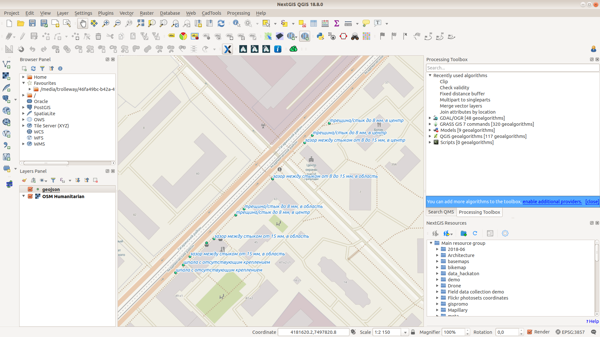

.. sectionauthor:: Artem Svetlov <artem.svetlov@nextgis.ru>

.. _ngsimplecollector_surveyor:

Начало работы для сборщика
==========================

1. Скачайте приложение Простые учёты с `Google Play <https://play.google.com/store/apps/details?id=com.nextgis.simple_collector>`_.
2. Введите имя Web GIS, логин, пароль, которые вам сообщил администратор.
3. Вы увидите список сборщиков, выберите себя.
4. Нажмите "Синхронизировать" чтобы увидеть последние изменения в проекте.
5. Можно начинать работу. Нажмите "Начать" и используйте кнопки на форме для сбора данных.

После окончания сбора
=====================

Данные будут добавлены как слой Веб ГИС. Вы можете загрузить их в формате GeoJSON или CSV (система координат EPSG:3857).

Альтернативно: запустите NextGIS QGIS, подключитесь к Web GIS с помощью NextGIS Connect и загрузите слой прямо в ГИС.

  
   Собранные данные в NextGIS QGIS

Возможные неисправности
=======================

Сообщение "Ошибка инициализации" при попытке входа может появиться если вы подключаетесь через приложение к разным Веб ГИС (например, сначала на trolleway.nextgis.com, потом на mostram.nextgis.com) или входите в одну и ту же Веб ГИС с разными учетными записями. При сообщении "Ошибка инициализации" найдите в настройках Android --> Синхронизация --> настройки для приложения NextGIS Простые учёты, и удалите старые аккаунты.

.. figure:: _static/ng_simplecollector_android_synchronisation_accounts.jpg
   :name: ng_simplecollector_android_synchronisation_accounts
   :align: center
   :scale: 30%
  
   Список аккаунтов для синхронизации в Android
